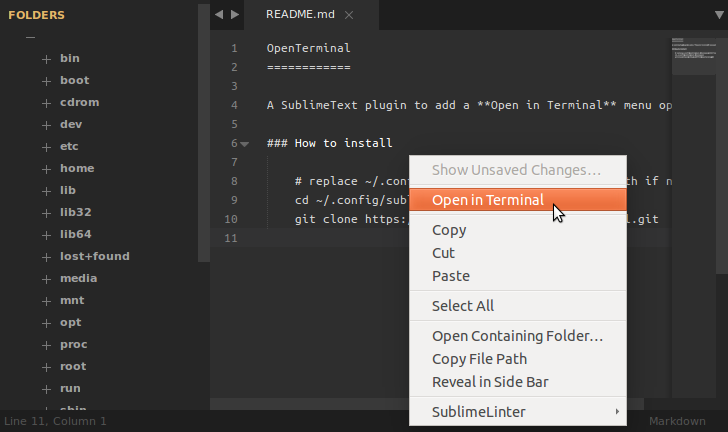
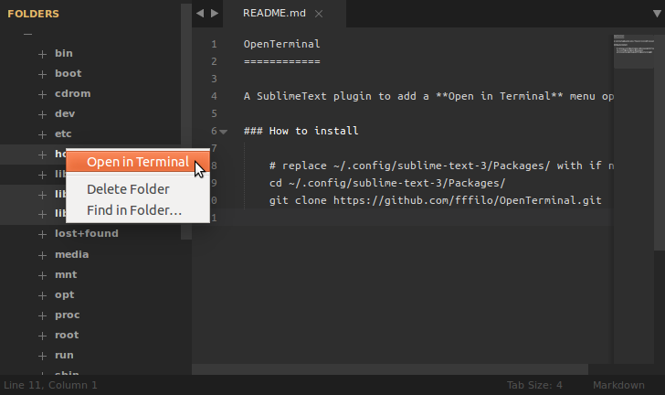
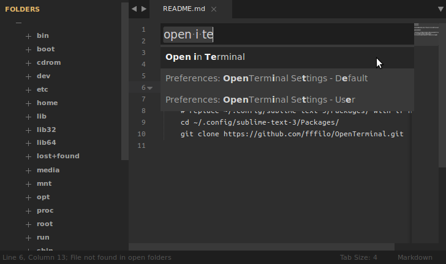

OpenTerminal
============

A SublimeText plugin to add a **Open in Terminal** menu option...

### How to install

Clone this repository into you sublime packages directory. On linux you would do something like this:

	cd ~/.config/sublime-text-3/Packages/
	git clone https://github.com/fffilo/OpenTerminal.git

Replace `~/.config/sublime-text-3/Packages/` with your path. On OSX this is ussualy `~/Library/Application Support/Sublime Text 3/Packages`, and `C:\Program Files\Sublime Text 3\Packages` on Windows.

### How to use

### Settings

If you wish to change your terminal application (in my example instead of using `gnome-terminal` I will use `terminator`) just change command in your settings:

	{
		"command": "terminator --working-directory=\"{0}\"",
	}
